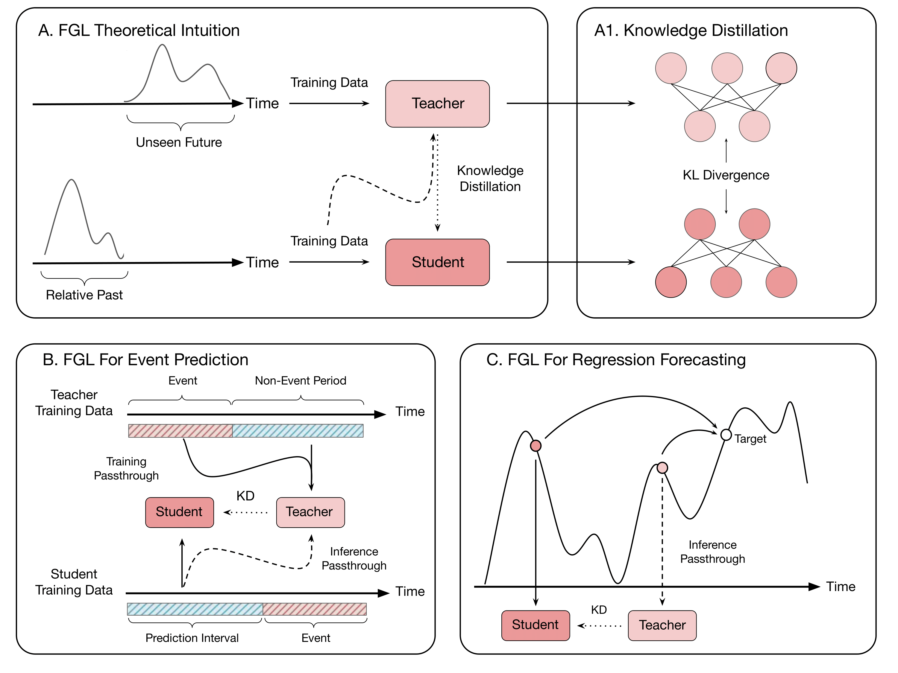

# A Predictive Approach to Enhance Time-Series Forecasting

[](https://doi.org/10.1038/s41467-025-63786-4)
[](https://www.python.org/downloads/release/python-3110/)
[](https://opensource.org/licenses/MIT)

This repository contains the official implementation for the paper: **"A predictive approach to enhance time-series forecasting"**.

Future-Guided Learning (FGL) is a novel approach that enhances time-series event forecasting using a dynamic feedback mechanism inspired by predictive coding. FGL utilizes a "teacher" model that analyzes future data to identify key events and a "student" model that learns to predict these events from current data. By minimizing the discrepancy between the teacher's near-future insights and the student's long-horizon predictions, FGL allows the forecasting model to dynamically adapt and improve its accuracy.

---

## Key Results

Our experiments demonstrate that FGL significantly improves forecasting performance across different domains:

* **EEG-based Seizure Prediction:** Achieved a **44.8%** average increase in AUC-ROC on the CHBMIT dataset.
* **Nonlinear Dynamical Systems:** Reduced Mean Squared Error (MSE) by **23.4%** in forecasting the Mackey-Glass time series (outlier excluded).


<details>
<summary><b>Figure 1: Detailed Overview of the FGL Framework. (Click to expand)</b></summary>
(A) FGL Theoretical Intuition:</b> A "teacher" model operates on near-future data, while a "student" model makes long-term forecasts from past data. Knowledge is transferred from the teacher to the student. <b>(A1) Knowledge Distillation:</b> Information is transferred by minimizing the Kullback-Leibler (KL) divergence between the models' output probability distributions. <b>(B) Event Prediction:</b> The teacher is trained on actual events (e.g., seizures), and its knowledge is distilled to guide the student's forecasts. <b>(C) Regression Forecasting:</b> The teacher makes short-term predictions, providing a dynamic guide to enhance the student's long-term forecasting accuracy.
</details>

---

## 1. Setup and Installation

The experiments were conducted using Python 3.11.7 and CUDA 12.1.

1.  **Clone the repository:**
    ```bash
    git clone [https://github.com/your-username/FutureGuidedLearning.git](https://github.com/your-username/FutureGuidedLearning.git)
    cd FutureGuidedLearning
    ```

2.  **Install dependencies:**
    All required packages are listed in `requirements.txt`.
    ```bash
    pip install -r requirements.txt
    ```

---

## 2. Dataset Preparation

This repository supports three datasets. For the EEG datasets, please download the data and place the patient folders inside a `Dataset/` directory at the root of this project.

### AES (American Epilepsy Society)
* **Description:** Intracranial EEG (iEEG) recordings from 5 dogs and 2 human patients.
* **Source:** [Kaggle Seizure Prediction Challenge](https://www.kaggle.com/competitions/seizure-prediction).
* **Setup:** Download and place the patient data folders into the `Dataset/` directory.

### CHB-MIT (Children's Hospital Boston - MIT)
* **Description:** Intracranial EEG recordings from 23 pediatric patients. We train only on select patients with sufficient preictal data, as specified in `main.py`.
* **Source:** [PhysioNet](https://physionet.org/content/chbmit/1.0.0/).
* **Setup:** Download and place the patient data inside the `Dataset/` folder.

### Mackey-Glass
* **Description:** A synthetic time-series dataset generated from the Mackey-Glass delay differential equation, used for controlled forecasting experiments.
* **Setup:** This dataset is generated automatically by the scripts.

---

## 3. Running the Experiments

Scripts for each experiment are provided below.

### Seizure Prediction (AES & CHB-MIT)

1.  **(AES Only) Create Universal Teacher Models:** The AES dataset lacks seizure labels, so we use a pre-trained "universal teacher"[cite: 275, 276]. First, run this script to generate and save the teacher models.
    ```bash
    python create_teacher.py
    ```

2.  **Run FGL Training:** Execute the main FGL scripts for either dataset.
    * **CHB-MIT Example:**
        ```bash
        python FGL_CHBMIT.py --target Patient_1 --epochs 30 --trials 3 --optimizer_type Adam --alpha 0.5 --temperature 4
        ```
    * **AES Example:**
        ```bash
        python FGL_AES.py --target Dog_1 --epochs 25 --trials 3 --optimizer_type Adam --alpha 0.7 --temperature 4
        ```

### Mackey-Glass Forecasting

The `FGL_MG.py` script handles the entire pipeline for the Mackey-Glass dataset, including training the teacher, the baseline model, and the FGL student.

* **Mackey-Glass Example:**
    ```bash
    python FGL_MG.py --horizon 5 --num_bins 50 --epochs 20 --optimizer SGD --alpha 0.5 --temperature 4
    ```

---

## 4. Hyperparameter Tuning

Future-Guided Learning leverages Knowledge Distillation, which is primarily controlled by two hyperparameters:

* **Alpha ($\alpha$):** A float between 0 and 1 that balances the contribution of the standard task loss (e.g., cross-entropy) and the KL divergence distillation loss. A higher $\alpha$ relies more on the ground-truth labels.
* **Temperature ($T$):** A positive value that softens the probability distributions (logits) from the teacher and student models before calculating the KL divergence. Higher temperatures result in softer distributions, transferring more generalized knowledge.

Optimal values for these parameters can be found via hyperparameter sweeps, as detailed in the supplementary materials of our paper.

---

## 5. Preprocessing Pipeline

All data preprocessing steps are located in the `utils/` directory and are handled automatically by the training scripts.

#### EEG Datasets (AES & CHB-MIT)
1.  EEG signals are classified as **preictal, ictal, or interictal**.
2.  **Short-Time Fourier Transforms (STFT)** are applied to convert signals into spectrograms.
3.  For the student model, the seizure occurrence period is set to 30 minutes, with a prediction horizon of 5 minutes.

#### Mackey-Glass Dataset
1.  Time-series values are generated using the Mackey-Glass equation.
2.  For the regression task, target values are discretized into a specified number of bins, converting the problem into a classification task to enable knowledge distillation.
3.  PyTorch `DataLoader` objects are created for training and testing.

---

## Citation

If you find this work useful in your research, please consider citing our paper:

```
@article{Gunasekaran2025,
  author = {Gunasekaran, Skye and Kembay, Assel and Ladret, Hugo and Zhu, Rui-Jie and Perrinet, Laurent and Kavehei, Omid and Eshraghian, Jason},
  title = {A predictive approach to enhance time-series forecasting},
  journal = {Nature Communications},
  year = {2025},
  volume = {16},
  number = {8645},
  pages = {1--7},
  doi = {10.1038/s41467-025-63786-4}
}
```
